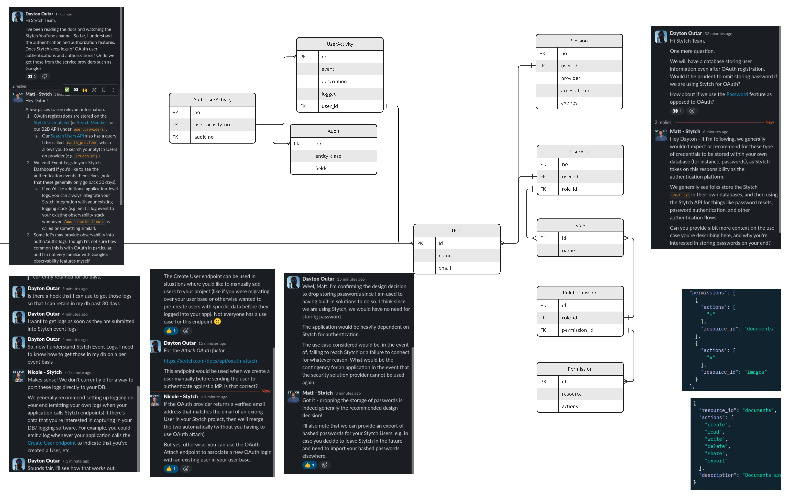

# Authentication and Authorization Data Model

See below good suggestions for data model for authentication and authorization for this project.

This data model is a strong starting point for backend infrastructure that needs to support authentication, authorization, session management, and operational auditing. It separates identity concerns from access-control concerns, while still making it easy to trace who did what, when it happened, and which permissions were in effect.

For backend systems, that separation is valuable. Authentication answers the question, "Who is this user?" Authorization answers, "What is this user allowed to do?" Auditing answers, "What happened in the system, and who was responsible?" This structure keeps those responsibilities distinct while linking them cleanly through the `User` record.

## Why This Structure Works Well

At the center of the model is the `User` table. It acts as the canonical identity record for people or operators interacting with the application. From there, supporting tables branch into specialized responsibilities:

- `Session` stores active or historical login sessions tied to a user and an authentication provider.
- `Role`, `Permission`, `UserRole`, and `RolePermission` implement a flexible role-based access control pattern.
- `UserActivity`, `Audit`, and `AuditUserActivity` support event tracking and audit traceability.

This is a good design for infrastructure because it avoids packing every responsibility into a single user table. Instead, it uses a normalized model that is easier to secure, query, evolve, and integrate with external identity providers.

## Authentication Support

The `Session` table is especially useful for modern backend applications that depend on OAuth, OpenID Connect, SSO, or another external identity system. Rather than storing raw credentials in the application database, the system can associate a user with a provider, store access token metadata where appropriate, and track expiration for lifecycle management.

That approach supports several common infrastructure needs:

- integrating with third-party identity providers
- tracking concurrent sessions per user
- expiring or revoking sessions cleanly
- separating login state from the core user profile

This makes the model suitable for applications that use a centralized identity service while still needing local persistence for application-level users and access policies.

## Authorization Support

The authorization side of the design follows a proven many-to-many pattern:

- a user can have many roles through `UserRole`
- a role can contain many permissions through `RolePermission`
- each permission can describe access to a specific resource and its allowed actions

This is a practical model for backend infrastructure because roles can express business responsibilities such as `admin`, `operator`, `auditor`, or `support`, while permissions can remain granular enough to control operations like `create`, `read`, `update`, `delete`, `share`, or `export`.

The diagram also suggests a permission format that maps well to resource-oriented APIs. For example, permissions can be expressed against resources such as `documents`, `images`, or other domain entities. That becomes very useful when securing REST endpoints, GraphQL resolvers, queue consumers, scheduled jobs, or internal administration tools.

## Audit and Observability Value

A major strength of this model is that it does not stop at authentication and authorization. It also includes `UserActivity` and `Audit` tables, connected through `AuditUserActivity`. That means the platform can capture both human-readable activity history and structured audit details for later analysis.

This is important for backend operations because infrastructure teams often need to answer questions like:

- Which user triggered this action?
- Which entity or record was changed?
- What fields were involved?
- When was the event logged?
- Was the action permitted under the user’s assigned role?

With this model, those answers become much easier to retrieve for incident response, compliance reviews, security investigations, and operational troubleshooting.

## Why It Fits Infrastructure Setup

When standing up backend infrastructure, teams usually need more than simple login support. They need a durable identity layer that can be reused across services and environments. This data structure supports that goal in several ways:

- It provides a stable local user record even when authentication is delegated to an external provider.
- It allows authorization rules to be managed internally and independently from the login mechanism.
- It supports audit logging that can feed reporting, monitoring, and compliance workflows.
- It scales well as applications grow from a single service into multiple backend components.

Because the model is relational and normalized, it also works well with migration tooling, ORM frameworks, SQL reporting, and administrative dashboards. It is straightforward to index, easy to join across entities, and practical for enforcing referential integrity.

## Recommended Usage Notes

To make this structure even more production-ready for backend applications, it is worth applying a few implementation practices:

- add timestamps such as `created_at`, `updated_at`, `revoked_at`, and `last_seen_at`
- store provider-specific identifiers in the session or identity mapping layer
- hash or encrypt sensitive token material when retention is required
- define unique constraints on role names, permission definitions, and user-role combinations
- add foreign key indexes for fast joins across user, role, permission, and audit tables
- consider soft deletes or archival rules for long-term audit retention

If password-based login is ever needed in addition to OAuth or SSO, password hashes should live in a dedicated credential table rather than being mixed into general user metadata.

## Conclusion

This model is well-suited for backend infrastructure because it treats identity, access control, and auditability as first-class concerns. It gives the application a central user record, a flexible role-permission system, session tracking for modern authentication flows, and an audit trail that supports both operational insight and security governance.

In short, it is a clean and extensible foundation for applications that need to manage who can access the system, what they can do inside it, and how their actions are recorded over time.
